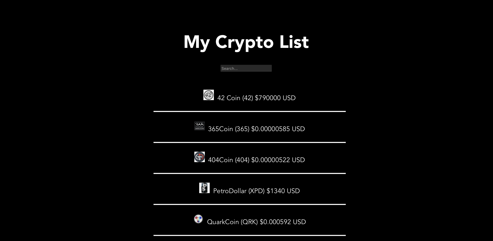
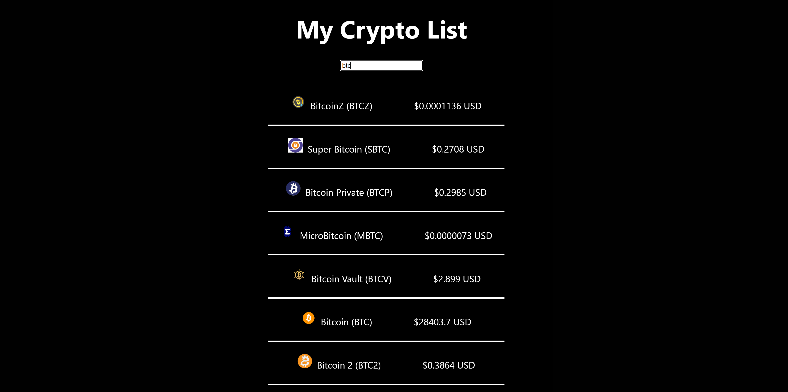

# CryptoExplorer
An app that displays information about cryptocurrencies, such as their value, market cap, and percent change in value, which are accessed using API calls. An search bar is also implemented, which allows users to search for a specific currency.


## Pictures Walkthrough

Here's a walkthrough shows the game:





<!-- Replace this with whatever GIF tool you used! -->


## API
-   Setup and account and get an API key from CryptoCompare
-   Go to the [CryptoCompare website](https://www.cryptocompare.com/) and make a free account with your email. After making a free account, please go to Account > API Keys and make a new API Key. There will be a pop up asking what level of permissions your key needs, just check the "Read All Price Streaming and Polling Endpoints" option. Copy the API Key for use later.
## Setup/Run Steps

### Dependencies

* [Vite](https://www.npmjs.com/package/vite)
* [Vite React Plugin](https://www.npmjs.com/package/@vitejs/plugin-react)
* [React](https://www.npmjs.com/package/react)
* [React-DOM](https://www.npmjs.com/package/react-dom)

---

### Install Dependencies

Before installing dependiencies, you will need `node` and `npm` installed globally on your machine by installing  [NodeJS](https://nodejs.org/en/download/) onto your machine.

To install the dependencies, run:

```sh
npm install
```

Alternatively, you can install the dependencies individually:

```sh
npm install vite
npm install @vitejs/plugin-react
npm install react
npm install react-dom
```

---

### Run Coffee-Codebreaker

In the repo directory, run the following in your terminal:

```sh
npm run dev

```

Visit the web application in the browser:

```html
http://localhost:5173/
```

<br/>

---
<!--

### Deploy Community Board

To deploy this application on Netlify, run the following in your terminal:
```sh
npm install
npm run build
```

Upload the generated `dist` file to Netflify at:
```html
https://app.netlify.com/drop
```
-->
*Last Updated: March 2023*

View an example of what was implemented [here](https://steady-cannoli-5d4e1b.netlify.app/)!


